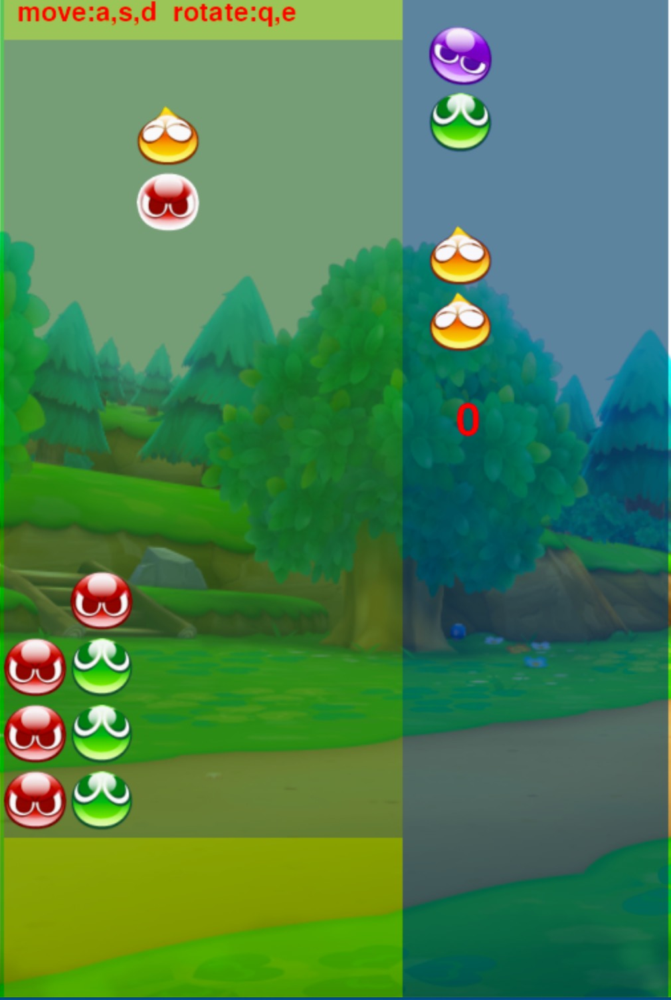

# pygame-puyo
This project is a puyo puyo game, developed using pygame. It's a simple program. You can use it to study python and pygame.
# how to run it
## install dependencies
pip install pygame
## run the game
python3 puyo_main.py
# screenshot
## game menu

## one player

## two players
